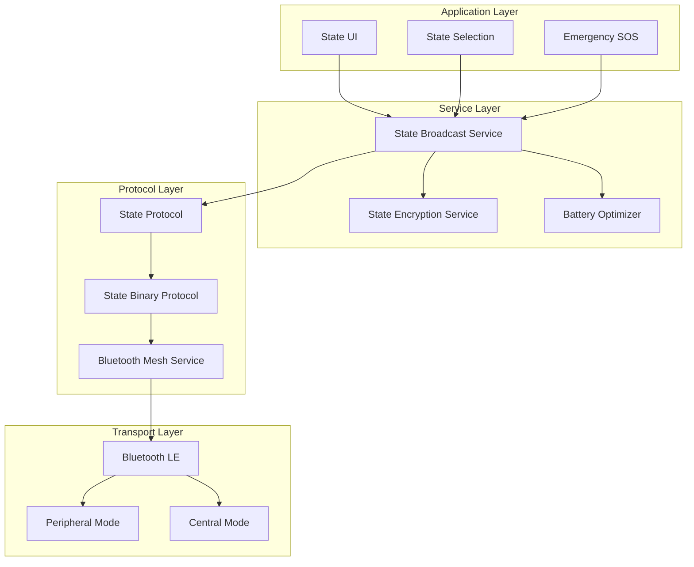

# Stately Technical Whitepaper

## Abstract

Stately is a minimal, decentralized state broadcasting application that operates over Bluetooth Low Energy (BLE) mesh networks. It provides ephemeral, encrypted status sharing without relying on internet infrastructure, making it resilient to network outages and ideal for proximity-based status awareness. This whitepaper details the technical architecture, protocols, and privacy mechanisms that enable secure, decentralized state broadcasting.

## Table of Contents

1. [Introduction](#introduction)
2. [Architecture Overview](#architecture-overview)
3. [Bluetooth Mesh Network](#bluetooth-mesh-network)
4. [State Broadcasting Protocol](#state-broadcasting-protocol)
5. [STATE_UPDATE Message Format](#state_update-message-format)
6. [Encryption and Security](#encryption-and-security)
7. [State Types and Management](#state-types-and-management)
8. [Binary Protocol Specification](#binary-protocol-specification)
9. [Privacy Features](#privacy-features)
10. [Battery Optimization](#battery-optimization)
11. [Emergency SOS System](#emergency-sos-system)
12. [Conclusion](#conclusion)

## Introduction

Stately addresses the need for proximity-based status awareness that doesn't depend on centralized infrastructure. By leveraging Bluetooth Low Energy mesh networking, Stately enables direct peer-to-peer state broadcasting within physical proximity, with automatic state relay extending awareness beyond direct Bluetooth connections.

### Key Features

- **Decentralized**: No servers, no infrastructure dependencies
- **Ephemeral**: States exist only in device memory (5-minute expiry)
- **Encrypted**: AES-256-GCM encryption for all state broadcasts
- **Resilient**: Automatic mesh networking and state relay (3-hop TTL)
- **Private**: No phone numbers, emails, or permanent identifiers
- **Battery Optimized**: Adaptive broadcast intervals based on power state

## Architecture Overview

<div align="center">



</div>

## Bluetooth Mesh Network

### Network Topology

Stately creates a dynamic mesh network where each device acts as both a state broadcaster and relay node. The network topology is:

- **Decentralized**: No master/slave hierarchy
- **Self-organizing**: Automatic peer discovery and connection
- **Adaptive**: Dynamic routing based on proximity and battery state
- **Resilient**: Automatic healing when nodes leave the network

### Connection Management

Each device maintains:
- **Peripheral Mode**: Advertising state availability
- **Central Mode**: Scanning for nearby peers
- **Connection Pool**: Up to 20 active peer connections (performance mode)
- **Battery Scaling**: Reduced connections in power-saving modes

### State Propagation

States propagate through the mesh network using:
- **TTL-based Relay**: Maximum 3 hops to prevent broadcast storms
- **Duplicate Detection**: State deduplication using sender ID + timestamp
- **Expiry Management**: Automatic cleanup of stale states (5 minutes)

## State Broadcasting Protocol

### Broadcasting Schedule

- **Default Interval**: 15 seconds
- **Battery Adaptive**: 10s (performance) → 30s (power saver) → 60s (ultra low power)
- **Emergency Override**: SOS states broadcast every 5 seconds
- **Background Optimization**: Extended intervals when app backgrounded

### State Message Types

Stately introduces a new message type in the existing protocol:

```
MessageType.stateUpdate = 0x0A
```

### State Lifecycle

1. **State Creation**: User selects state from predefined types
2. **State Encryption**: AES-256-GCM encryption with shared broadcast key
3. **State Broadcasting**: Periodic transmission to connected peers
4. **State Relay**: TTL-based forwarding through mesh network
5. **State Expiry**: Automatic cleanup after 5 minutes

## STATE_UPDATE Message Format

### Packet Structure

```
Header (12 bytes):
┌─────────┬─────────┬─────┬───────────┬──────────────┐
│ Version │  Type   │ TTL │ Timestamp │ PayloadLength│
│ 1 byte  │ 1 byte  │1 b  │  8 bytes  │   2 bytes    │
└─────────┴─────────┴─────┴───────────┴──────────────┘

Variable Sections:
┌──────────┬─────────────────────┐
│ SenderID │ Encrypted Payload   │
│ 8 bytes  │ Variable length     │
└──────────┴─────────────────────┘
```

### JSON Payload Format

```json
{
  "name": "Alice",
  "state": "working",
  "timestamp": 1641024000000
}
```

### State Types

```swift
enum PeerStateType: String, CaseIterable {
    case sleeping = "sleeping"     // 💤 Not available
    case sos = "sos"              // 🆘 Emergency - needs help
    case redCircle = "red_circle"  // 🔴 Do not disturb
    case available = "available"   // ✅ Ready to connect
    case busy = "busy"            // 🔶 Currently occupied
    case away = "away"            // 🏃 Temporarily away
    case invisible = "invisible"   // 👻 Hidden from others
    case working = "working"       // 💼 Focused on work
    case eating = "eating"         // 🍽️ Having a meal
    case traveling = "traveling"   // ✈️ On the move
}
```

## Encryption and Security

### State Encryption

- **Algorithm**: AES-256-GCM
- **Key Management**: Shared broadcast key derived from "StateBeacon2024"
- **Nonce**: 96-bit random nonce per encryption
- **Padding**: Privacy-preserving message padding to obscure state content length

### Security Model

```swift
class StateEncryptionService {
    private let broadcastKey: SymmetricKey
    
    func encryptStatePayload(_ data: Data) -> Data? {
        // Apply privacy padding
        let paddedData = MessagePadding.pad(data, toSize: targetSize)
        
        // Encrypt with AES-GCM
        let sealedBox = try AES.GCM.seal(paddedData, using: broadcastKey)
        return sealedBox.combined
    }
}
```

### Privacy Features

- **Ephemeral States**: No persistent storage, states expire after 5 minutes
- **Shared Key Encryption**: All peers use same broadcast key for state mesh
- **Privacy Padding**: Message padding to obscure actual state content length
- **No Persistent IDs**: Temporary peer IDs generated per session

## State Types and Management

### State Selection

Users can select from 10 predefined states, each with:
- **Emoji Representation**: Visual indicator (💤, 🆘, 🔴, etc.)
- **Display Name**: Human-readable description
- **Semantic Meaning**: Clear intent for status communication

### State Persistence

- **Ephemeral**: States exist only in device memory
- **Session-based**: States reset when app is terminated
- **Expiry**: Automatic cleanup after 5 minutes of inactivity
- **No History**: No logging or persistence of past states

## Binary Protocol Specification

### Encoding Implementation

```swift
struct StateBinaryProtocol {
    static func encode(_ packet: StatePacket) -> Data? {
        var data = Data()
        
        // Header
        data.append(packet.version)      // 1 byte
        data.append(packet.type)         // 1 byte (0x0A)
        data.append(packet.ttl)          // 1 byte (default 3)
        
        // Timestamp (8 bytes, big-endian)
        for i in (0..<8).reversed() {
            data.append(UInt8((packet.timestamp >> (i * 8)) & 0xFF))
        }
        
        // Payload length (2 bytes, big-endian)
        let payloadLength = UInt16(packet.payload.count)
        data.append(UInt8((payloadLength >> 8) & 0xFF))
        data.append(UInt8(payloadLength & 0xFF))
        
        // SenderID (8 bytes, padded)
        data.append(packet.senderID.prefix(8))
        if packet.senderID.count < 8 {
            data.append(Data(repeating: 0, count: 8 - packet.senderID.count))
        }
        
        // Encrypted payload
        data.append(packet.payload)
        
        return data
    }
}
```

### Protocol Efficiency

- **Compact Headers**: 12-byte fixed header for minimal overhead
- **Binary Encoding**: Efficient byte-level encoding for BLE constraints
- **TTL Field**: Prevents infinite relay loops with 3-hop maximum
- **Timestamp Validation**: Automatic rejection of stale packets

## Privacy Features

### Data Minimization

- **Minimal Payload**: Only name, state, and timestamp
- **No Location Data**: No GPS or positioning information
- **No Persistent Storage**: States exist only in memory
- **No User Tracking**: No analytics or usage data collection

### Anonymity Features

- **Temporary IDs**: Session-based peer identifiers
- **No Registration**: No accounts or sign-up process
- **Local Processing**: All state management happens on-device
- **Mesh Anonymity**: State origin obscured through multi-hop relay

## Battery Optimization

### Adaptive Broadcasting

```swift
enum PowerMode {
    case performance    // 10s intervals (charging/high battery)
    case balanced      // 15s intervals (default)
    case powerSaver    // 30s intervals (low battery)
    case ultraLowPower // 60s intervals (critical battery)
}
```

### Power Management

- **Battery Monitoring**: Real-time battery level and charging state tracking
- **Background Optimization**: Reduced broadcasting when app backgrounded
- **Connection Scaling**: Fewer peer connections in power-saving modes
- **Duty Cycling**: Adaptive scan/advertise cycles based on power state

### Implementation

```swift
class BatteryOptimizer {
    func shouldOptimizeForBattery() -> Bool {
        return batteryLevel < 0.3 || 
               currentPowerMode == .powerSaver || 
               currentPowerMode == .ultraLowPower
    }
    
    var optimizedBroadcastInterval: TimeInterval {
        switch currentPowerMode {
        case .performance: return 10.0
        case .balanced: return 15.0
        case .powerSaver: return 30.0
        case .ultraLowPower: return 60.0
        }
    }
}
```

## Emergency SOS System

### SOS Broadcasting

- **Priority Transmission**: SOS states broadcast every 5 seconds
- **Extended TTL**: SOS messages get maximum relay hops
- **Local Notifications**: Nearby peers receive immediate SOS alerts
- **Visual Priority**: SOS states highlighted in red in peer lists

### Emergency Response

```swift
func triggerSOS() {
    // Set emergency state
    updateMyState(.sos)
    
    // Trigger haptic feedback
    let impactFeedback = UIImpactFeedbackGenerator(style: .heavy)
    impactFeedback.impactOccurred()
    
    // Send priority broadcast immediately
    broadcastMyState()
    
    // Notify local system
    sendSOSNotification()
}
```

### SOS Features

- **One-Tap Access**: Always visible red emergency button
- **Haptic Feedback**: Physical confirmation of SOS activation
- **Clear SOS**: Green button to clear emergency state
- **Network Priority**: SOS states prioritized in mesh relay

## Conclusion

Stately represents a focused approach to decentralized status broadcasting, leveraging the proven mesh networking capabilities of its predecessor while optimizing specifically for ephemeral state sharing. The system balances simplicity with security, providing a robust platform for proximity-based status awareness without compromising user privacy or battery life.

### Future Enhancements

- **Android Compatibility**: Cross-platform state broadcasting
- **Custom States**: User-defined state types and emojis
- **Group States**: Team or family state broadcasting
- **Integration APIs**: Third-party app state integration

The architectural decisions documented in this whitepaper ensure Stately can scale while maintaining its core principles of decentralization, privacy, and efficiency.